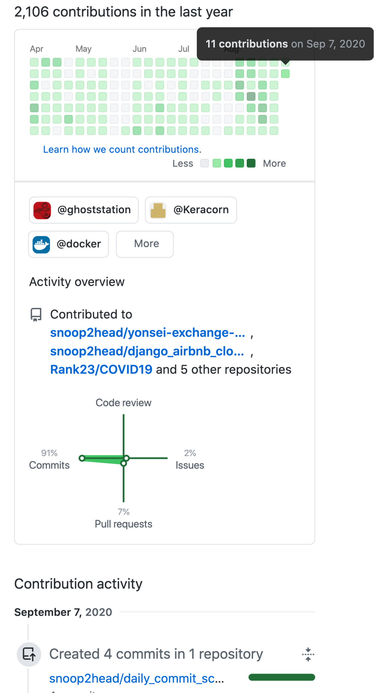

# Daily Github Commit Report

### 기능

[카카오프로젝트100 1일 1커밋 챌린지](https://project100.kakao.com/project/4422)에 유저가 커밋한 내역을 자동으로 스크린샷을 찍어주는 파이썬3 코드입니다.



### 설치 방법

```bash
git clone 
pip install -r requirements.txt
```

### 실행 방법

```bash
python3 main.py
```

혹은

```bash
chmod +x ./start.sh
./start.sh
```

